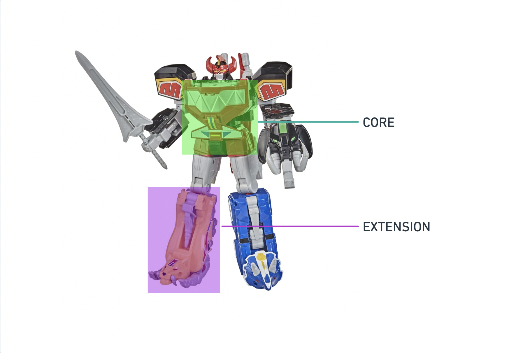

<p align="center">
<br />
<a href="https://thirdweb.com"></a>
<br />
</p>
<h1 align="center">Modular Contracts</h1>
<p align="center"><strong>A framework for writing highly composable smart contracts for which you can add, remove, upgrade or switch out the exact parts you want</strong></p>
<br />

A Modular Contract is built of two kinds of parts: a _Modular Core_ and its _Modular Extensions_.



A developer writes a **_Core_** smart contract as the foundation that can be customized by adding new parts and updating or removing these parts over time. These ‘parts’ are **_Extension_** smart contracts which any third-party developer can independently develop with reference to the **_Core_** smart contract as the known foundation to build around.

Both `/core` and `/extension` directories are their own forge projects where we develop the Core API of the architecture independently from the Extensions that use this Core API as a dependency.

# Run this repo

Clone the repo:

```bash
git clone https://github.com/thirdweb-dev/modular-contracts.git
```

Install dependencies:

If you are in the root directory of the project, run:

```bash
# Install dependecies for core contracts
forge install --root ./core

# Install dependecies for extension contracts
forge install --root ./extension
```

<!-- From within `/contracts`, run benchmark comparison tests:

```bash
# create a wallet for the benchmark (make sure there's enough gas funds)
cast wallet import testnet -i

# deploy the benchmark contracts and perform the tests
forge script script/benchmark-ext/erc721/BenchmarkERC721.s.sol --rpc-url "https://sepolia.rpc.thirdweb.com" --account testnet [--broadcast]
```

From within `/contracts`, run gas snapshot:

```bash
forge snapshot --isolate --mp 'test/benchmark/*'
``` -->

## Feedback

If you have any feedback, please create an issue or reach out to us at support@thirdweb.com.

## Authors

- [thirdweb](https://thirdweb.com)

## License

[Apache 2.0](https://www.apache.org/licenses/LICENSE-2.0.txt)
